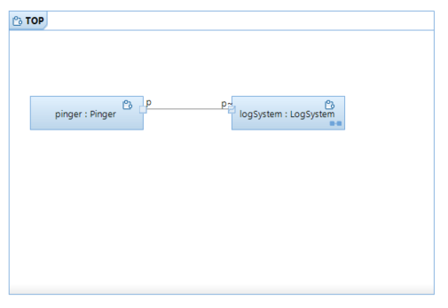

# Dependency Injection
[Dev Ops Model RealTime](https://www.hcl-software.com/devops-model-realtime) allows you to customize how capsule instances are created in a realtime application by means of dependency injection. This sample application uses build variants as the means for configuring the dependency injection.

## Sample Application

The application consists of a `pinger` which emits 10 `ping` messages at a certain speed, and a `logSystem` which prints a log message each time it receives one of those `ping` messages. By default the `ping` messages are emitted slowly with 2 seconds between each message, and the log messages just contain a simple "Pinged" message.

Here is the composite structure diagram of the `Top` capsule that shows the simple structure of this application:



Assume that we want to configure two things in this simple application:
1. the speed at which `ping` messages are emitted
2. whether log messages should contain a timestamp or not

We can implement these variations by means of capsules that inherit from the capsules that implement the default behavior:


For an optional capsule part we can type it with an abstract capsule, and then at run-time decide which sub capsule to incarnate the part with. The capsule part `logger` in `LogSystem` is such an example. It's typed by `AbstractLogger` and by default it gets incarnated with an instance of the `NoTimestampLogger`. However, by defining another sub capsule `TimestampLogger` we can implement the logging in a different way, including a timestamp for each log message.

A fixed capsule part is normally typed with a concrete capsule, but we can still define a sub capsule with a modified behavior that we can choose to use instead. `Pinger` is such an example, and it has a sub capsule `FastPinger` which emits the `ping` messages at a faster pace (0.5 seconds between each).

## Configuring Dependency Injection

The TargetRTS provides a class `RTInjector` which allows create functions to be registered for capsule parts. Whenever a capsule instance is created in a capsule part for which such a create function has been registered, the TargetRTS will call that function to let it create the capsule instance. For all other capsule parts, the default capsule instantiation takes place.

The registration of create functions must happen early, at least before the first capsule instance gets created which we may want to customize by means of dependency injection. In this application we do it in the constructor of the `Top` capsule.

There are different ways how you can implement the dependency injection configuration. In this application we use [Build Variants](https://model-realtime.hcldoc.com/help/topic/com.ibm.xtools.rsarte.webdoc/Articles/Building/Build%20Variants/index.html) which allows us to configure at build-time which capsules to use. If you prefer to configure dependency injection without having to rebuild the application, you can for example use a configuration file instead. Read the configuration file at application start-up and let it decide which create functions to register.

## Building the Application

Open the model in Model RealTime and go to **Window - Preferences - RealTime Development - Build/Transformations - C++**. Click the **Workspace** button for the preference **Use build variants for build configuration** and browse to the file `build_variants.js`. Then build the transformation configuration `top.tcjs` (you may first have to change to a different target configuration depending on your platform and C++ compiler).

In the Build dialog that appears you can now specify which `Pinger` and which `Logger` implementations to use:


The build variants are implemented by means of two compilation macros:

* **TIMESTAMP_LOGGER** If set, the `TimestampLogger` capsule will be used instead of the default `NoTimestampLogger`.
* **FAST_PINGER** If set, the `FastPinger` capsule will be used instead of the default `Pinger`.

The macros are used in the `Top` capsule constructor to configure dependency injection:

```cpp
#ifdef TIMESTAMP_LOGGER
RTInjector::getInstance().registerCreateFunction("/logSystem:0/logger",
		[this](RTController * c, RTActorRef * a, int index) {						
			return new TimestampLogger_Actor(c, a);
		}
);
#endif
#ifdef FAST_PINGER
RTInjector::getInstance().registerCreateFunction("/pinger",
		[this](RTController * c, RTActorRef * a, int index) {
			return new FastPinger_Actor(c, a);
		}
);
#endif
```

Remember that you need to rebuild the application each time you change the build variant configuration. Do a Clean build to ensure everything gets rebuilt.

## Running the Application

You can either run the application from the transformation configuration context menu (**Run As - RealTime Application**) or from the command-line:

```bash
<target-folder>/default> executable -URTS_DEBUG=quit
```

The application prints 10 log messages with a 2 or 0.5 seconds interval, either with or without timestamps.